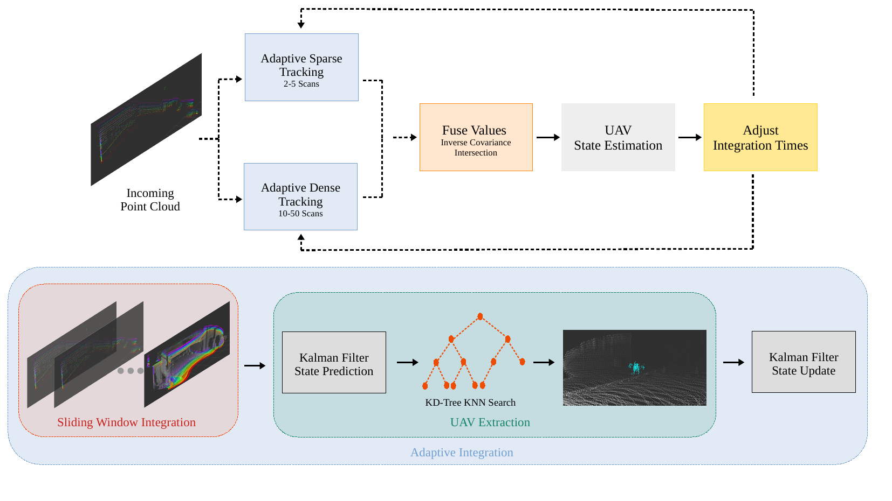
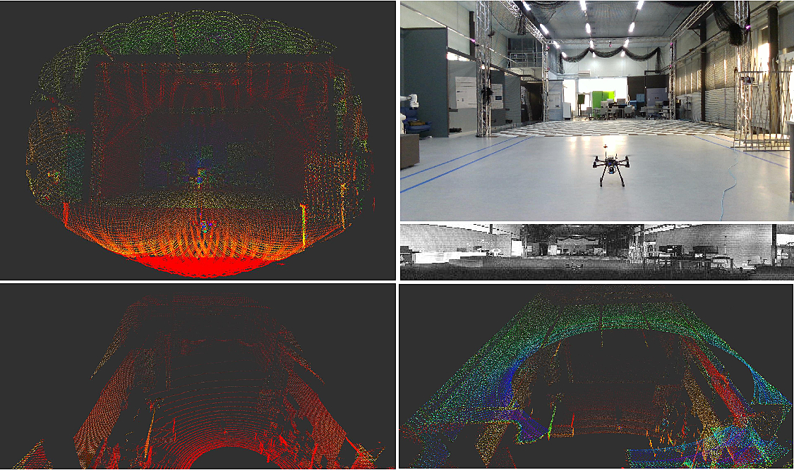

A comprehensive list of my work can also be found on [Google Scholar](https://scholar.google.com/citations?user=VnPwRvkAAAAJ&hl=en).

     
    <strong> UAV Tracking with Solid-State Lidars: Dynamic Multi-Frequency Scan Integration </strong>
      
    <em> <u>Iacopo Catalano</u>, Ha Sier, Xianjia Yu, Tomi Westerlund and Jorge Peña Queralta (2023)</em>
     
    <a href="https://arxiv.org/pdf/2304.12125.pdf" itemprop="sameAs">
        <i class="ai ai-arxiv ai-fw"></i> PDF
    </a>
    &nbsp;&nbsp;
    <a href="https://tiers.github.io/dynamic_scan_tracking" itemprop="sameAs">
        <i class="far fa-file-code"></i> Project
    </a>

     
    <strong> Towards Robust UAV Tracking in GNSS-Denied Environments: A Multi-LiDAR Multi-UAV Dataset </strong>
      
    <em> <u>Iacopo Catalano</u>, Xianjia Yu and Jorge Peña Queralta (2023)</em>
     
    <a href="" itemprop="sameAs">
        <i class="ai ai-arxiv ai-fw"></i> PDF
    </a>
    &nbsp;&nbsp;
    <a href="https://tiers.github.io/multi_lidar_multi_uav_dataset" itemprop="sameAs">
        <i class="far fa-file-code"></i> Project
    </a>

