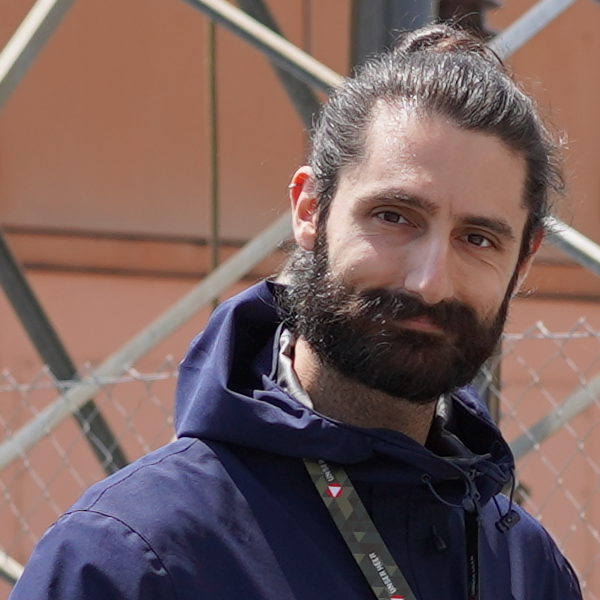

<title>Resume | Iacopo Catalano</title>

<!-- Meta -->
<meta charset="utf-8">
<meta http-equiv="X-UA-Compatible" content="IE=edge">
<meta name="viewport" content="width=device-width, initial-scale=1.0">
<meta name="description" content="Responsive Resume Template">
<meta name="author" content="Xiaoying Riley at 3rd Wave Media">    
<link rel="shortcut icon" href="favicon.ico"> 

<!-- Academicons -->
<link rel="stylesheet" href="https://cdn.jsdelivr.net/gh/jpswalsh/academicons@1/css/academicons.min.css">

<!-- Theme CSS -->  
<link id="theme-style" rel="stylesheet" href="../assets/css/resume.css">

<article class="resume-wrapper text-center position-relative">
    

        <header class="resume-header pt-4 pt-md-0">
            

                

                    
                
<!--//col-->
                

                    

                        

                            <h1 class="name mt-0 mb-1 text-white text-uppercase text-uppercase">Iacopo Catalano</h1>
                            
Doctoral Researcher

                            <ul class="list-unstyled">
                                <li class="mb-2"><a class="text-link" href="mailto:imcata@utu.fi"><i class="far fa-envelope fa-fw me-2" data-fa-transform="grow-3"></i>imcata@utu.fi</a></li>
                            </ul>
                        
<!--//primary-info-->
                        

                            <ul class="resume-social list-unstyled">
                                <li class="mb-3">
                                    <a class="text-link" href="https://www.linkedin.com/in/iacopocatalano"><i class="fab fa-linkedin-in fa-fw"></i>LinkedIn</a>
                                </li>
                                <li class="mb-3">
                                    <a class="text-link" href="https://github.com/iacopomc"><i class="fab fa-github-alt fa-fw"></i>Github</a>
                                </li>
                                <li class="mb-3">
                                    <a class="text-link" href="https://scholar.google.com/citations?user=VnPwRvkAAAAJ&hl=en">
                                        <i class="ai ai-google-scholar ai-fw"></i>Google Scholar
                                        </a>
                                </li>
                            </ul>
                        
<!--//secondary-info-->
                    
<!--//row-->

                
<!--//col-->
            
<!--//row-->
        </header>
        

            <!--<section class="resume-section summary-section mb-5">
                <h2 class="resume-section-title text-uppercase font-weight-bold pb-3 mb-3">Career Summary</h2>
                

                    
Summarise your career here. <a class="text-reset text-link" href="https://themes.3rdwavemedia.com/resources/sketch-template/pillar-sketch-sketch-resume-template-for-developers/" target="_blank">You can make a PDF version of your resume using our free Sketch template here</a>. Aenean commodo ligula eget dolor aenean massa. Cum sociis natoque penatibus et magnis dis parturient montes, nascetur ridiculus mus. Donec quam felis, ultricies nec, pellentesque eu. Lorem ipsum dolor sit amet, consectetuer adipiscing elit. Aenean commodo ligula eget dolor. Aenean massa. Cum sociis natoque penatibus et magnis dis parturient montes, nascetur ridiculus mus. Donec quam felis, ultricies nec, pellentesque eu, pretium quis, sem. Nulla consequat massa quis enim. Donec pede justo, fringilla vel, aliquet nec, vulputate eget. Lorem ipsum dolor sit amet, consectetuer adipiscing elit.

                

            </section><!--//summary-section-->
            

                

                    <section class="resume-section experience-section mb-5">
                        <h2 class="resume-section-title text-uppercase font-weight-bold pb-3 mb-3">Professional Experience</h2>
                        

                            

                                <article class="resume-timeline-item position-relative pb-5">
                                    
                                    

                                        

                                            <h3 class="resume-position-title font-weight-bold mb-1">Doctoral Researcher</h3>
                                            
University of Turku

                                        
<!--//row-->
                                        
9/2023 - Present

                                    
<!--//resume-timeline-item-header-->
                                    

                                        
&#x2022; Researching multi-robot collaboration for UAVs accurate positioning and ground-aided sense-and-avoid.

                                        <!-- <ul>
                                            <li>Lorem ipsum dolor sit amet, 80% consectetuer adipiscing elit.</li>
                                            <li>At vero eos et accusamus et iusto odio dignissimos.</li>
                                            <li>Blanditiis praesentium voluptatum deleniti atque corrupti.</li>
                                            <li>Maecenas tempus tellus eget.</li>
                                        </ul>
                                        <h4 class="resume-timeline-item-desc-heading font-weight-bold">Technologies used:</h4>
                                        <ul class="list-inline">
                                            <li class="list-inline-item">Angular</li>
                                            <li class="list-inline-item">Python</li>
                                            <li class="list-inline-item">jQuery</li>
                                            <li class="list-inline-item">Webpack</li>
                                            <li class="list-inline-item">HTML/SASS</li>
                                            <li class="list-inline-item">PostgresSQL</li>
                                        </ul> -->
                                    
<!--//resume-timeline-item-desc-->
                                </article><!--//resume-timeline-item-->
                                <article class="resume-timeline-item position-relative pb-5">
                                    

                                        

                                            <h3 class="resume-position-title font-weight-bold mb-1">Research Intern</h3>
                                            
KU Leuven

                                        
<!--//row-->
                                        
2/2022 - 8/2022

                                    
<!--//resume-timeline-item-header-->
                                    

                                        
&#x2022; Master thesis: Researched a 3D mapping framework for a SLAM pipeline using RGB-D images in C++.
                                        

                                    
<!--//resume-timeline-item-desc-->

                                </article><!--//resume-timeline-item-->
                                <article class="resume-timeline-item position-relative pb-5">
                                    

                                        

                                            <h3 class="resume-position-title font-weight-bold mb-1">Research Intern</h3>
                                            
Laboratoire Hubert Curien

                                        
<!--//row-->
                                        
4/2021 - 7/2021

                                    
<!--//resume-timeline-item-header-->
                                    

                                        
&#x2022; Explored the use of Siamese CNNs based Multi-Object tracking algorithms to find the set of features that best distinguish between similar small electronic parts in real-time.

                                    
<!--//resume-timeline-item-desc-->
                                </article><!--//resume-timeline-item-->
                                <article class="resume-timeline-item position-relative pb-5">
                                    

                                        

                                            <h3 class="resume-position-title font-weight-bold mb-1">Junior Data Scientist</h3>
                                            
Accenture

                                        
<!--//row-->
                                        
1/2020 - 8/2020

                                    
<!--//resume-timeline-item-header-->
                                    

                                        
&#x2022; Researched and adapted existing algorithms in Computer Vision.
                                         
                                        &#x2022; Conducted exploratory data analysis.
                                         
                                        &#x2022; Supported Senior Data Scientists in algorithm design.

                                    
<!--//resume-timeline-item-desc-->
                                </article><!--//resume-timeline-item-->
                                <article class="resume-timeline-item position-relative pb-5">
                                    

                                        

                                            <h3 class="resume-position-title font-weight-bold mb-1">Front-end Web Developer</h3>
                                            
Accenture

                                        
<!--//row-->
                                        
2/2019 - 1/2020

                                    
<!--//resume-timeline-item-header-->
                                    

                                        
&#x2022; Developed new web applications using Angular, Bootstrap, Angular Material and JavaScript.
                                         
                                        &#x2022; Redesigned existing web applications to improve browser compatibility.
                                         
                                        &#x2022; Oversaw new interns on project milestones.

                                    
<!--//resume-timeline-item-desc-->
                                </article><!--//resume-timeline-item-->
                                <article class="resume-timeline-item position-relative">
                                    

                                        

                                            <h3 class="resume-position-title font-weight-bold mb-1">Front-end Web Developer <small class="text-muted">(Intern)</small></h3>
                                            
Accenture

                                        
<!--//row-->
                                        
9/2018 - 2/2019

                                    
<!--//resume-timeline-item-header-->
                                    

                                        
&#x2022; Worked with Senior Developers to manage large, complex design projects.
                                         
                                        &#x2022; Assisted team with testing code on multiple browsers.

                                    
<!--//resume-timeline-item-desc-->
                                </article><!--//resume-timeline-item-->
                            
<!--//resume-timeline-->
                        

                    </section><!--//experience-section-->
                    <section class="resume-section experience-section mb-5">
                        <h2 class="resume-section-title text-uppercase font-weight-bold pb-3 mb-3">Education</h2>
                        

                            

                                <article class="resume-timeline-item position-relative pb-5">
                                    
                                    

                                        

                                            <h3 class="resume-position-title font-weight-bold mb-1">Master of Engineering</h3>
                                            
Toyohashi University of Technology

                                        
<!--//row-->
                                        
2020 - 2022

                                    
<!--//resume-timeline-item-header-->
                                </article><!--//resume-timeline-item-->
                                <article class="resume-timeline-item position-relative pb-5">
                                    

                                        

                                            <h3 class="resume-position-title font-weight-bold mb-1">M.Sc. Optics, Image, Vision, Multimedia</h3>
                                            
University Jean Monnet

                                        
<!--//row-->
                                        
2020 - 2022

                                    
<!--//resume-timeline-item-header-->
                                </article><!--//resume-timeline-item-->
                                <article class="resume-timeline-item position-relative pb-5">
                                    

                                        

                                            <h3 class="resume-position-title font-weight-bold mb-1">M.Sc. Computer Science in XR</h3>
                                            
University of Eastern Finland

                                        
<!--//row-->
                                        
2020 - 2022

                                    
<!--//resume-timeline-item-header-->
                                </article><!--//resume-timeline-item-->
                                <article class="resume-timeline-item position-relative pb-5">
                                    

                                        

                                            <h3 class="resume-position-title font-weight-bold mb-1">B.Sc. Physics</h3>
                                            
Sapienza University of Rome

                                        
<!--//row-->
                                        
2010 - 2018

                                    
<!--//resume-timeline-item-header-->
                                </article><!--//resume-timeline-item-->
                            
<!--//resume-timeline-->
                        

                    </section><!--//education-section-->
                

                

                    <section class="resume-section skills-section mb-5">
                        <h2 class="resume-section-title text-uppercase font-weight-bold pb-3 mb-3">Skills</h2>
                        

                            

                                <h4 class="resume-skills-cat font-weight-bold">Programming</h4>
                                <ul class="list-unstyled mb-4">
                                    <li class="mb-2">
                                        
C++

                                        

                                            

                                        

                                    </li>
                                    <li class="mb-2">
                                        
Python

                                        

                                            

                                        

                                    </li>
                                    <li class="mb-2">
                                        
ROS

                                        

                                            

                                        

                                    </li>
                                    
                                    <li class="mb-2">
                                        
MATLAB

                                        

                                            

                                        

                                    </li>
                                </ul>
                            
<!--//resume-skill-item-->
                            
                            

                                <h4 class="resume-skills-cat font-weight-bold">ML/DL</h4>
                                <ul class="list-unstyled">
                                    <li class="mb-2">
                                        
OpenCV

                                        

                                            

                                        

                                    </li>
                                    <li class="mb-2">
                                        
Tensorflow

                                        

                                            

                                        

                                    </li>
                                    <li class="mb-2">
                                        
Scikit-Learn

                                        

                                            

                                        

                                    </li>
                                </ul>
                            
<!--//resume-skill-item-->
                            
                            

                                <h4 class="resume-skills-cat font-weight-bold">Others</h4>
                                <ul class="list-inline">
                                    <li class="list-inline-item">Code Review</li>
                                    <li class="list-inline-item">Git</li>
                                    <li class="list-inline-item">Unit Testing</li>
                                </ul>
                            
<!--//resume-skill-item-->
                        
<!--resume-section-content-->
                    </section><!--//skills-section-->
                    <section class="resume-section reference-section mb-5">
                        <h2 class="resume-section-title text-uppercase font-weight-bold pb-3 mb-3">Awards</h2>
                        

                            <ul class="list-unstyled resume-awards-list">
                                <li class="mb-2 ps-4 position-relative">
                                    <i class="resume-award-icon fas fa-trophy position-absolute" data-fa-transform="shrink-2"></i>
                                    
EMJMD Erasmus Mundus Scholarship

                                    
Two-year full scholarship awarded by the European Commission to best students from different countries to study in Top Universities across Europe. Program selected: IMLEX.

                                </li>
                            </ul>
                        

                    </section><!--//interests-section-->
                    <section class="resume-section language-section mb-5">
                        <h2 class="resume-section-title text-uppercase font-weight-bold pb-3 mb-3">Language</h2>
                        

                            <ul class="list-unstyled resume-lang-list">
                                <li class="mb-2">Italian <small class="text-muted font-weight-normal">(Native)</small></li>
                                <li class="mb-2 align-middle">English <small class="text-muted font-weight-normal">(Proficient)</small></li>
                                <li>Spanish <small class="text-muted font-weight-normal">(Intermediate)</small></li>
                                <li>French <small class="text-muted font-weight-normal">(Elementary)</small></li>
                            </ul>
                        

                    </section><!--//language-section-->
                    <section class="resume-section language-section mb-5">
                        <h2 class="resume-section-title text-uppercase font-weight-bold pb-3 mb-3">Volunteering</h2>
                        

                            Team Coordinator <small class="text-muted font-weight-normal">(AGESCI)</small>
                            
2001 - 2015

                            
Coordinated, mentored, and trained several scout groups of different ages.

                        

                    </section><!--//volunteer-section-->
                    
                

            
<!--//row-->
        
<!--//resume-body-->
        
        
    

</article>

